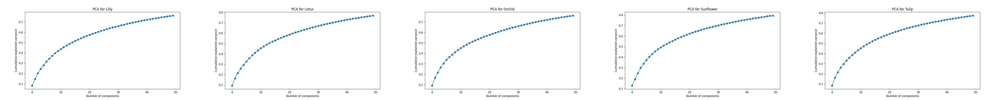
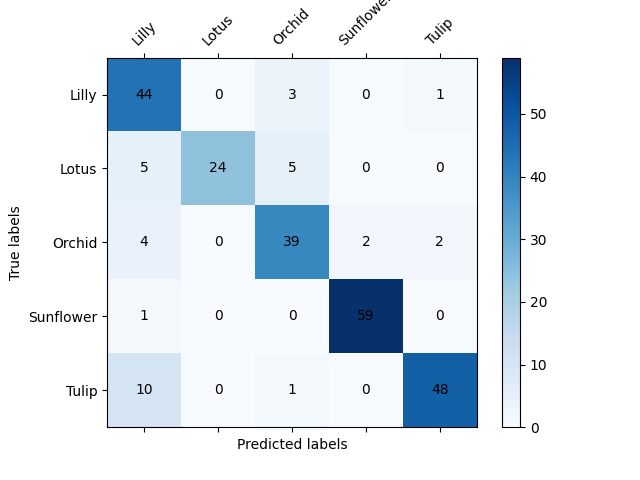
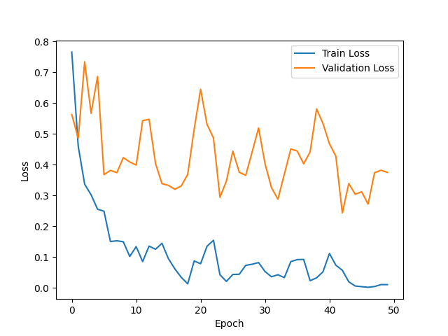
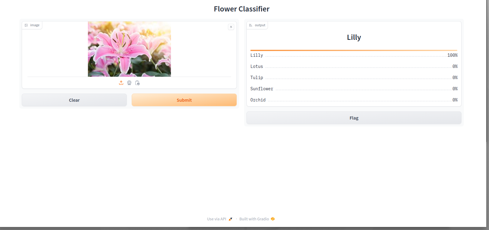

# Project Name: Flower Classification with PyTorch and Gradio

This project aims to develop a machine learning model for automatic flower classification.

## Dataset

In this project, a dataset containing various flower species will be used. The dataset will include flower images and their corresponding labels.

Data: https://www.kaggle.com/datasets/kausthubkannan/5-flower-types-classification-dataset

## Model Training

For model training, convolutional neural networks (CNN), which are a type of deep learning algorithm, will be used. CNN is an effective method for processing image data and extracting features.
## Installation and Usage

Follow the steps below to run the project:

1. Use the `requirements.txt` file to install the necessary dependencies.
2. Download the dataset and prepare it accordingly.
3. Run the `main.py` to apply resoultion, cropping and get the image embeddings.
4. Run the `train.py` file to train the model.
5. Use the `gradio_interface.py` file to classify flowers using the trained model.

## Results

The PCA and K-Means clustering methods were used to cluster the images based on their embeddings.There is the result of the clustering and reduced dimensionality of the images.

The success criterion of this project is the model's ability to classify flower species using a confusion matrix and loss function. The performance of the model on both the training and test datasets will be evaluated, and the results will be reported.

Methods used in this project include:

- Unsupervised Learning for cropping
- Extracting image embeddings
- Clustering images using PCA and K-Means
- Transfer Learning with Torch
- GUI development using Gradio

## Contribution

This project is open source, and we welcome your contributions. Feel free to submit a pull request for any bug fixes, new features, or improvements.

## License

This project is licensed under the MIT License. Please refer to the `LICENSE` file for more information.

